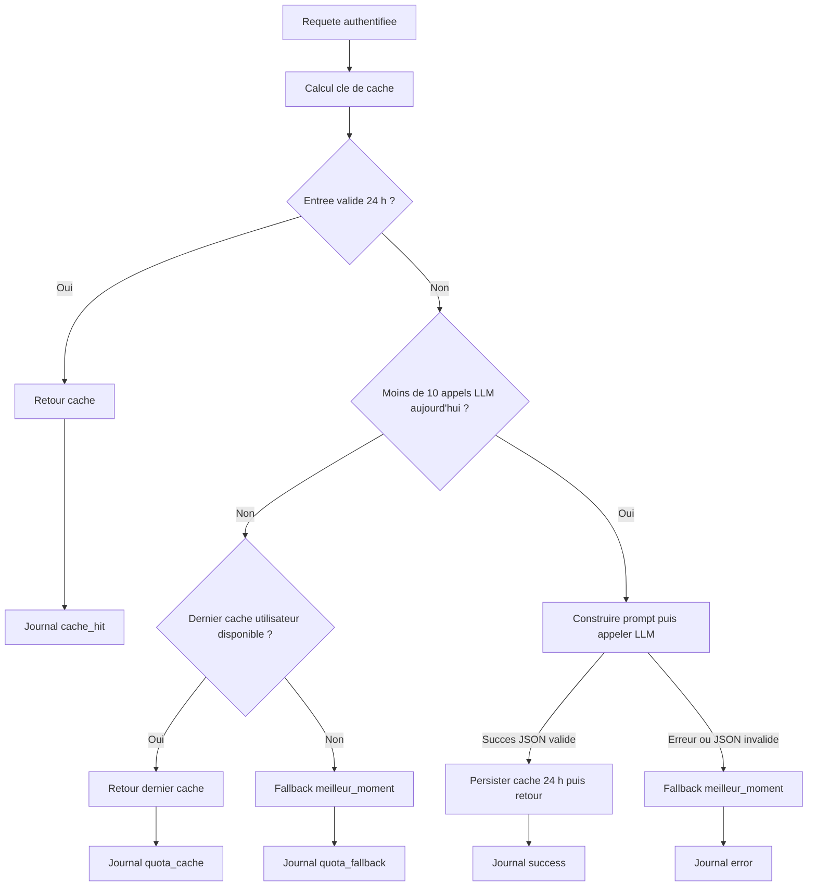

# Cache, quota et journalisation des recommandations LLM

## Objectif

Cette conception complete la section 5.4 d'AGENTS.md pour
`GET /api/taches/recommandation_ia/`. Le contrat public reste:

```json
{"heures_recommandees": [9, 14], "message": "..."}
```

Le stockage passe par PostgreSQL et non par `LocMemCache`. Les entrees sont
ainsi partagees par tous les workers Django. Une migration sera necessaire
lors de l'implementation.

## Decisions

- Cache: TTL de 24 heures et invalidation explicite lors des changements de
  taches ou de preferences.
- Quota: fenetre calendaire, de minuit a minuit selon `timezone.localdate()`.
  Elle est simple a expliquer et a verifier en base.
- Limite: au plus dix appels externes au LLM par utilisateur et par jour.
- Journalisation: aucun contenu de prompt ou de reponse n'est conserve. Les
  identifiants utilisateur sont pseudonymises avec HMAC-SHA-256.
- Retention: les journaux de plus de 30 jours sont purges sur environ 1 % des
  requetes de recommandation.

## Modeles Django

Les deux modeles seront ajoutes a `backend/api/models.py` et migres. Le cache
conserve le `utilisateur` pour le fonctionnement de l'application. Le journal
ne conserve pas cette cle etrangere.

### `EntreeCacheRecommandation`

| Champ | Type Django | Contraintes et index |
| --- | --- | --- |
| `utilisateur` | `ForeignKey(User)` | `on_delete=CASCADE`, index implicite |
| `cle` | `CharField(max_length=255)` | unique, indexe; format `llm_reco:{user_id}:{hash}` |
| `recommandation` | `JSONField` | contrat public valide avant ecriture |
| `expire_a` | `DateTimeField` | indexe; `created_at + 24 h` |
| `created_at` | `DateTimeField(auto_now_add=True)` | horodatage |

Index compose supplementaire: `(utilisateur, expire_a)`. Il permet de trouver
la derniere entree non expiree de l'utilisateur si le quota est atteint, meme
si la cle courante a change.

La partie `{hash}` est un SHA-256 d'un JSON canonique contenant les
identifiants de taches tries et les champs de preferences injectes au prompt.
Une modification du contenu d'une tache est couverte par les signaux plutot
que par ce hash.

### `JournalAppelLLM`

| Champ | Type Django | Contraintes et index |
| --- | --- | --- |
| `user_hash` | `CharField(max_length=64)` | HMAC-SHA-256 du `user_id`, indexe |
| `prompt_hash` | `CharField(max_length=64)` | SHA-256 du prompt complet, indexe |
| `prompt_length` | `PositiveIntegerField` | longueur du prompt en caracteres |
| `duration_ms` | `PositiveIntegerField(null=True)` | duree externe; nulle sans appel |
| `status` | `CharField(max_length=32)` | `cache_hit`, `success`, `error`, `quota_cache`, `quota_fallback` |
| `cache_hit` | `BooleanField` | vrai pour les retours caches |
| `error_type` | `CharField(max_length=100, blank=True)` | classe technique, sans message |
| `created_at` | `DateTimeField(auto_now_add=True)` | indexe |

Index compose: `(user_hash, created_at)`. Le quota compte les lignes du jour
avec statut `success` ou `error`: chacune represente un appel LLM externe
tente. Les chemins cache et quota ne sont pas comptes.

`user_hash` est calcule par HMAC-SHA-256 avec `settings.SECRET_KEY` et
`user_id`; `prompt_hash` est un SHA-256 du prompt. Aucun champ ne contient le
prompt, la reponse, l'ID utilisateur brut ou le message d'exception.

## Signaux d'invalidation

Un module `backend/api/signals.py`, charge depuis `ApiConfig.ready()`,
declarera les recepteurs suivants:

| Signal | Modele | Action |
| --- | --- | --- |
| `post_save` | `Tache` | supprimer les entrees de `instance.utilisateur_id` |
| `post_delete` | `Tache` | supprimer les entrees du meme utilisateur |
| `post_save` | `PreferenceUtilisateur` | supprimer les entrees du meme utilisateur |
| `post_delete` | `PreferenceUtilisateur` | supprimer les entrees du meme utilisateur |

L'invalidation est par utilisateur afin de couvrir les modifications et
suppressions qui ne peuvent pas etre deduites des identifiants de taches.
Elle ne touche jamais les journaux.

## Flux de l'endpoint



Avant ce flux, environ une requete sur cent declenche la purge des lignes
`JournalAppelLLM` dont `created_at` est anterieur a 30 jours. Le tirage utilise
une source aleatoire adaptee a la securite. Une purge en erreur ne bloque pas
la recommandation et ne doit pas consigner de donnees utilisateur.

## Concurrence et tests

Le controle du quota sera protege par une transaction de base afin que deux
requetes simultanees ne puissent pas depasser la limite. La version initiale
pourra verrouiller les journaux de l'utilisateur du jour lors du comptage et
de la creation du journal d'appel.

Les tests a ajouter couvriront:

1. cache hit sans appel LLM;
2. invalidation apres `post_save` et `post_delete` de `Tache` et de
   `PreferenceUtilisateur`;
3. dix appels externes autorises, puis cache ou fallback au onzieme;
4. champs de journalisation sans fuite de prompt, reponse ni identifiant brut;
5. purge probabiliste forcee par mock avec suppression des journaux de plus de
   30 jours.

## Hors perimetre

Cette conception ne definit pas Redis, un ordonnanceur de purge dedie, ni la
visualisation des journaux. Une purge planifiee pourra remplacer la purge
probabiliste si le trafic ou les exigences de retention evoluent.
